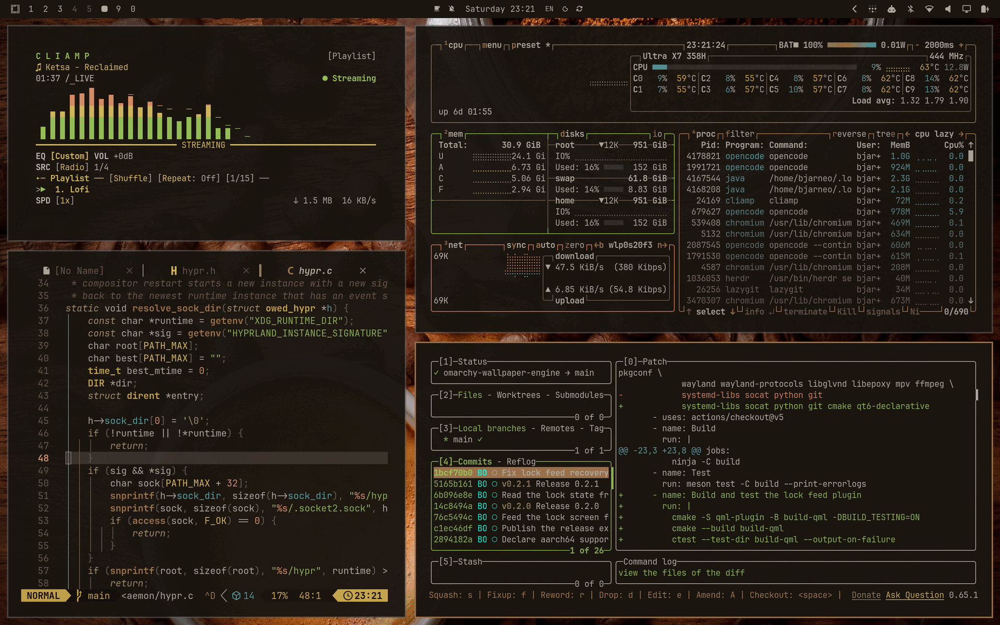

# Coffee Day

A light, coffee-toned theme for [Omarchy Quattro](https://github.com/basecamp/omarchy).

Steamed-milk backgrounds, espresso text, and caramel accents. A latte to the
Coffee theme's espresso.



## Installation

```bash
omarchy theme install https://github.com/bjarneo/omarchy-coffee-day-theme
```

Prefer the dark original? See [Coffee](https://github.com/bjarneo/omarchy-coffee-theme).

## Backgrounds

Eight wallpapers up to 6878x4780 and one coffee-shop video at 3840x2160.

## Credits

Based on Evergreen by [@iamdothash](https://x.com/iamdothash).
